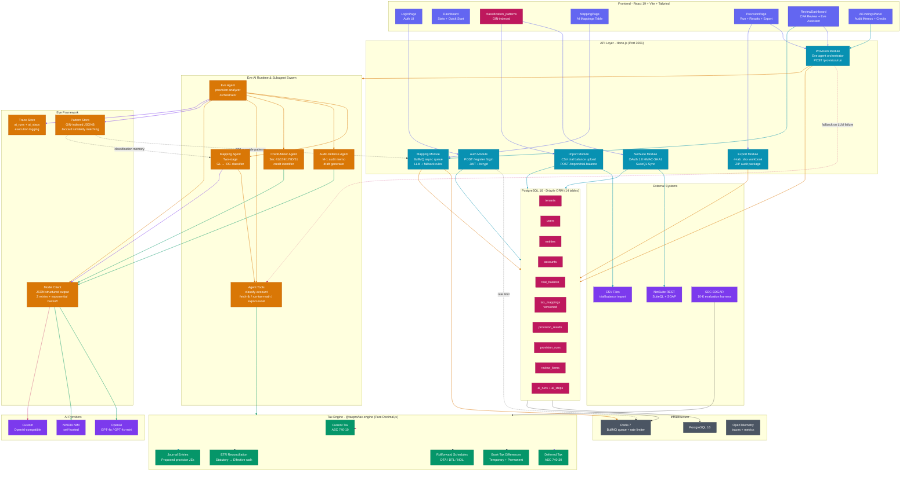

# TaxPro Architecture Diagram

```mermaid
graph TB
  classDef frontend fill:#6366f1,color:#fff,stroke:#4338ca
  classDef api fill:#0891b2,color:#fff,stroke:#0e7490
  classDef engine fill:#059669,color:#fff,stroke:#047857
  classDef ai fill:#d97706,color:#fff,stroke:#b45309
  classDef infra fill:#4b5563,color:#fff,stroke:#374151
  classDef external fill:#7c3aed,color:#fff,stroke:#6d28d9
  classDef storage fill:#be185d,color:#fff,stroke:#9d174d

  subgraph FRONTEND["Frontend - React 19 + Vite + Tailwind"]
    LP[LoginPage<br/>Auth UI]:::frontend
    DBpg[Dashboard<br/>Stats + Quick Start]:::frontend
    CP[ConnectionsPage<br/>NetSuite + CSV Import]:::frontend
    MP[MappingPage<br/>AI Mappings Table]:::frontend
    PP[ProvisionPage<br/>Run + Results + Export]:::frontend
    RP[ReviewDashboard<br/>CPA Review + Eve Assistant]:::frontend
    AFP[AiFindingsPanel<br/>Audit Memos + Credits]:::frontend
  end

  subgraph API["API Layer - Hono.js (Port 3001)"]
    AUTH[Auth Module<br/>POST /register /login<br/>JWT + bcrypt]:::api
    IMP[Import Module<br/>CSV trial balance upload<br/>POST /import/trial-balance]:::api
    NS[NetSuite Module<br/>OAuth 1.0 HMAC-SHA1<br/>SuiteQL Sync]:::api
    MAP[Mapping Module<br/>BullMQ async queue<br/>LLM + fallback rules]:::api
    PROV[Provision Module<br/>Eve agent orchestrator<br/>POST /provision/run]:::api
    EXP[Export Module<br/>4-tab .xlsx workbook<br/>ZIP audit package]:::api
  end

  subgraph EVE["Eve AI Runtime & Subagent Swarm"]
    AGT[Eve Agent<br/>provision analyzer<br/>orchestrator]:::ai
    MA[Mapping Agent<br/>Two-stage<br/>GL → IRC classifier]:::ai
    AD[Audit-Defense Agent<br/>M-1 audit memo<br/>draft generator]:::ai
    CM[Credit-Miner Agent<br/>Sec 41/174/179D/51<br/>credit identifier]:::ai
    TOOLS[Agent Tools<br/>classify-account<br/>fetch-tb / run-tax-math / export-excel]:::ai
  end

  subgraph EVE_FW["Eve Framework"]
    MC[Model Client<br/>JSON structured output<br/>2 retries + exponential backoff]:::ai
    PS[Pattern Store<br/>GIN-indexed JSONB<br/>Jaccard similarity matching]:::ai
    TS[Trace Store<br/>ai_runs + ai_steps<br/>execution logging]:::ai
  end

  subgraph ENGINE["Tax Engine - @taxpro/tax-engine (Pure Decimal.js)"]
    CT[Current Tax<br/>ASC 740-10]:::engine
    DT[Deferred Tax<br/>ASC 740-30]:::engine
    BTD[Book-Tax Differences<br/>Temporary + Permanent]:::engine
    RF[Rollforward Schedules<br/>DTA / DTL / NOL]:::engine
    ETR[ETR Reconciliation<br/>Statutory → Effective walk]:::engine
    JE[Journal Entries<br/>Proposed provision JEs]:::engine
  end

  subgraph DB["PostgreSQL 16 - Drizzle ORM (14 tables)"]
    T[tenants]:::storage
    U[users]:::storage
    ENT[entities]:::storage
    A[accounts]:::storage
    TB[trial_balance]:::storage
    TM[tax_mappings<br/>versioned]:::storage
    PRS[provision_results]:::storage
    PRR[provision_runs]:::storage
    RI[review_items]:::storage
    CP[classification_patterns<br/>GIN-indexed]:::storage
    AIR[ai_runs + ai_steps]:::storage
  end

  subgraph INFRA["Infrastructure"]
    PG[PostgreSQL 16]:::infra
    RD[Redis 7<br/>BullMQ queue + rate limiter]:::infra
    OTEL[OpenTelemetry<br/>traces + metrics]:::infra
  end

  subgraph AI_PROV["AI Providers"]
    OAI[OpenAI<br/>GPT-4o / GPT-4o-mini]:::external
    NVI[NVIDIA NIM<br/>self-hosted]:::external
    CUST[Custom<br/>OpenAI-compatible]:::external
  end

  subgraph EXTERNAL["External Systems"]
    NSAPI[NetSuite REST<br/>SuiteQL + SOAP]:::external
    CSV[CSV Files<br/>trial balance import]:::external
    EDGAR[SEC EDGAR<br/>10-K evaluation harness]:::external
  end

  %% Frontend → API flows
  LP --> AUTH
  CP --> NS
  CP --> IMP
  MP --> MAP
  PP --> PROV
  PP --> EXP
  RP --> PROV
  RP --> MAP
  AFP --> PROV

  %% API → Data flows
  AUTH --> DB
  IMP --> DB
  IMP --> CSV
  NS --> NSAPI
  NS --> DB
  MAP --> DB
  MAP --> RD
  PROV --> DB
  PROV --> EVE
  EXP --> DB

  %% Eve internal flows
  AGT --> MA
  AGT --> AD
  AGT --> CM
  MA --> TOOLS
  AGT --> TOOLS
  AGT --> MC
  AGT --> PS
  AGT --> TS
  MA --> MC
  AD --> MC
  CM --> MC
  TOOLS --> ENGINE

  %% Eve → AI providers
  MC --> OAI
  MC --> NVI
  MC --> CUST

  %% Eve fallback to direct calculation
  PROV -.->|fallback on LLM failure| TOOLS

  %% Engine modules
  ENGINE --> CT
  ENGINE --> DT
  ENGINE --> BTD
  ENGINE --> RF
  ENGINE --> ETR
  ENGINE --> JE

  %% Active learning loop
  PS -.->|CPA override patterns| MAP
  PS -.->|classification memory| MA

  %% Evaluation
  EDGAR --> ENGINE

  %% Infrastructure backing
  DB --> PG
  DB --> RD
  AUTH -.->|rate limit| RD

  linkStyle 0,1,2,3,4,5,6 stroke:#6366f1,stroke-width:1.5
  linkStyle 7,8,9,10,11,12,13 stroke:#0891b2,stroke-width:1.5
  linkStyle 14,15,16,17,18,19,20,21,22,23,24 stroke:#d97706,stroke-width:1.5
  linkStyle 25,26,27 stroke:#7c3aed,stroke-width:1.5
  linkStyle 28,29,30,31,32 stroke:#059669,stroke-width:1.5
  linkStyle 33,34,35 stroke:#be185d,stroke-width:1
  linkStyle 36 stroke:#7c3aed,stroke-width:1.5
  linkStyle 37,38,39 stroke:#4b5563,stroke-width:1
  linkStyle 40 stroke:#0891b2,stroke-width:1
```
