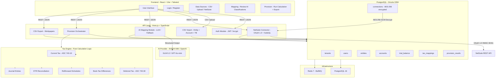

# TaxPro Architecture Diagram

```mermaid
graph TB
  subgraph Frontend["Frontend - React + Vite + Tailwind"]
    UI[User Interface]
    AuthUI[Login / Register]
    DS[Data Sources - CSV Upload / NetSuite]
    MP[Mapping - Review AI Classifications]
    PV[Provision - Run Calculation + Export]
  end

  subgraph API["API Layer - Hono.js + TypeScript"]
    AUTH[Auth Module - JWT / bcrypt]
    IMPORT[CSV Import - Entity + Account + TB]
    NS[NetSuite Connector - OAuth 1.0 + SuiteQL]
    MAP[AI Mapping Module - LLM / Fallback]
    PROV[Provision Orchestrator]
    EXP[CSV Export - Workpapers]
  end

  subgraph ENGINE["Tax Engine - Pure Calculation Logic"]
    CT[Current Tax - ASC 740-10]
    DT[Deferred Tax - ASC 740-30]
    BD[Book-Tax Differences]
    RF[Rollforward Schedules]
    ETR[ETR Reconciliation]
    JE[Journal Entries]
  end

  subgraph DB["PostgreSQL - Drizzle ORM"]
    T[tenants]
    U[users]
    C[connections - AES-256 encrypted]
    E[entities]
    A[accounts]
    TB[trial_balance]
    TM[tax_mappings]
    PR[provision_results]
  end

  subgraph AI["AI Provider - NVIDIA NIM / OpenAI"]
    LLM[GLM-5.2 / GPT-4o-mini]
  end

  subgraph INFRA["Infrastructure"]
    PG[PostgreSQL 16]
    RD[Redis 7 - BullMQ]
  end

  UI -- REST / JSON --> AUTH
  UI -- CSV Upload --> IMPORT
  UI -- REST / JSON --> NS
  UI -- REST / JSON --> MAP
  UI -- REST / JSON --> PROV
  UI -- REST / JSON --> EXP

  IMPORT --> DB
  NS -- OAuth 1.0 HMAC-SHA1 --> NSAPI[NetSuite REST API]
  NS --> DB
  MAP -- Structured Output --> LLM
  MAP --> DB
  PROV --> DB
  PROV --> ENGINE
  EXP --> DB
  ENGINE --> CT
  ENGINE --> DT
  ENGINE --> BD
  ENGINE --> RF
  ENGINE --> ETR
  ENGINE --> JE

  DB --> PG
  DB --> RD

  C -- AES-256-GCM Decrypt --> NS
```
