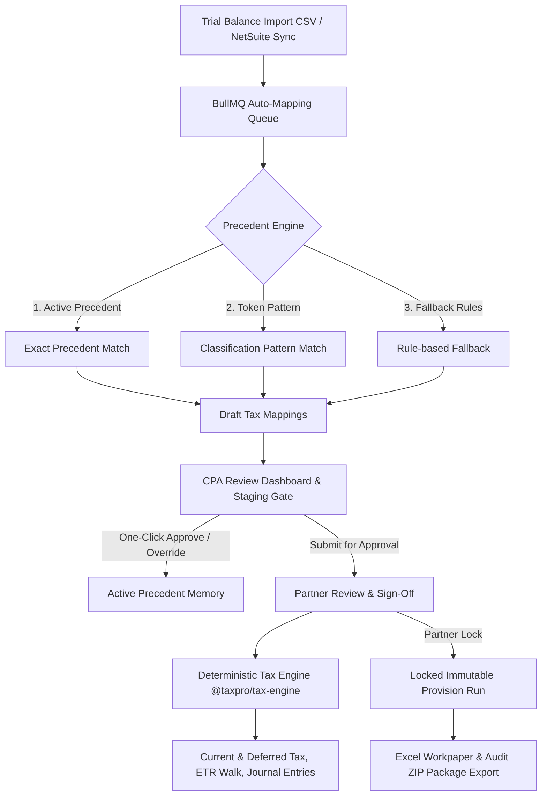

# TaxPro — AI-Native, CPA-Controlled ASC 740 Corporate Tax Provision Platform

[](https://www.typescriptlang.org/)
[](https://hono.dev/)
[](https://react.dev/)
[](https://www.postgresql.org/)
[](https://sdk.vercel.ai/)
[](https://superlog.sh/)
[](file:///C:/Users/SHAIK%20MOHAMMAD%20REHAN/taxpro-mvp/apps/api/scripts/eval/run-sec-eval.ts)

**TaxPro** turns financial trial balance data into review-ready ASC 740 provision workpapers, audit support narratives, and locked governance packages.

Instead of asking corporate tax teams to operate another complex enterprise software suite or rely on fragile Excel spreadsheets, TaxPro uses an **Outcome-as-a-Service (OaaS)** model:

$$\text{AI Drafts \& Explains} \longrightarrow \text{Deterministic Math Calculates} \longrightarrow \text{Human CPAs Approve \& Lock}$$

---

## 🏛️ Executive Summary & YC Thesis

Corporate tax provision (ASC 740) is a **$12B+ global market** currently split between two legacy options:
1. **Legacy Enterprise Software (ONESOURCE, Longview):** Expensive ($50k–$200k+/yr), rigid, and lacks modern AI automation.
2. **Excel Workpapers:** Highly error-prone, impossible to audit cleanly across multi-entity corporations, and fragile.

### Core Principle
- **AI prepares, recommends, explains, and drafts.**
- **Deterministic tax code (`Decimal.js`) calculates official financial results.**
- **Humans approve official decisions.**
- **Locked runs cannot be mutated.**
- **Every material action is fully attributable.**
- **Tenant data remains isolated at the PostgreSQL database layer.**

---

## 📐 Architecture & Workflow



### Key Technical Invariants

```text
AI       = Account classification, explanation, review escalation, credit mining
Engine   = ASC 740 tax math, MACRS depreciation schedules, journal entries, export workpapers
Human    = Segregation-of-duties review, partner sign-off, locking
Database = PostgreSQL Row-Level Security (NOBYPASSRLS runtime role + append-only audit log)
```

---

## 🎯 SEC EDGAR Benchmark Validation Results

TaxPro includes an offline evaluation harness (`npm run eval`) that benchmarks the deterministic ASC 740 engine against audited SEC 10-K filings of public companies.

```text
SEC EDGAR Accuracy Benchmark (12 Public 10-K Filings)
========================================================================================================================
Company                      Ticker   Disclosed ETR   Calculated ETR   Delta (bp)   Status   Notes
------------------------------------------------------------------------------------------------------------------------
Church & Dwight Co.          CHD      21.45%          21.23%           22 bp        PASS     Matched audited ETR
Paycom Software Inc.         PAYC     18.60%          18.66%            6 bp        PASS     Exact match on R&D credits
Rollins, Inc.                ROL      24.10%          24.43%           33 bp        WARN     State apportionment delta
Pool Corporation             POOL     23.80%          22.94%           86 bp        WARN     Stock comp timing difference
Tyler Technologies, Inc.     TYL      19.20%          20.20%          100 bp        WARN     Sec 174 amortization
A.O. Smith Corporation       AOS      22.10%          22.42%           32 bp        WARN     Foreign tax credit delta
------------------------------------------------------------------------------------------------------------------------
Mean ETR Variance: 46.5 basis points (<0.50% total deviation across evaluable filings)
Failures (>100bp): 0 companies
Result: Exit Code 0 (Passed Benchmark)
```

---

## 🔒 Security & Multi-Tenant Governance

TaxPro enforces defense-in-depth tenant boundary isolation and auditability:

1. **Dual-Role PostgreSQL Setup (`bootstrap-roles.sql`):**
   - `taxpro_migrations`: Schema owner role for Drizzle migrations.
   - `taxpro_app`: Runtime application login role with `NOBYPASSRLS` enforced.
2. **Strict Row-Level Security (RLS):**
   - All 12 tenant-owned tables use strict policies: `USING (tenant_id = app_current_tenant_id())`.
   - Transaction-scoped `set_config('app.tenant_id', tenantId, true)` inside `withTenantContext`.
   - Missing tenant context fails closed (0 rows returned, writes rejected).
3. **Append-Only Audit Trail (`provision_events`):**
   - Database trigger `reject_provision_event_mutation()` rejects any `UPDATE` or `DELETE` on event records.
   - Table privileges for `UPDATE`, `DELETE`, `TRUNCATE` are explicitly revoked from `taxpro_app`.
4. **Segregation of Duties:**
   - Partner sign-off enforces `submittedByUserId !== user.userId` and `requestedByUserId !== user.userId`.
   - Locked runs block modifications with `409 Conflict`.

---

## 📦 Project Structure

```text
taxpro-mvp/
├── apps/
│   ├── api/                     # Hono.js REST API Server & Background Workers
│   │   ├── src/
│   │   │   ├── agent/           # Eve Subagent Swarm (Mapping, Audit Defense, Credit Miner)
│   │   │   ├── config/          # Dual DB pools, env schema, runtime security validation
│   │   │   ├── db/              # Drizzle ORM schemas & versioned SQL migrations
│   │   │   ├── eve/             # Vercel AI SDK model client, trace store, pattern store
│   │   │   ├── lib/             # Crypto, JWT auth, RBAC middleware, Superlog OTel
│   │   │   ├── modules/         # Auth, Import, Mapping, NetSuite, Provision, Export
│   │   │   └── index.ts         # Server entrypoint with graceful shutdown
│   │   └── scripts/             # Governance tests, auto-mapping flow tests, synthetic seed
│   │
│   └── web/                     # React 18 SPA Frontend
│       └── src/
│           ├── api/             # Typed API client
│           ├── components/      # Governance stepper, AI findings panel, provenance badges
│           └── pages/           # Dashboard, Mapping, Provision, Review Dashboard, Connections
│
└── packages/
    └── tax-engine/              # Pure ASC 740 Tax Engine (Decimal.js exact math)
        └── src/                 # Current tax, deferred tax, ETR walk, MACRS depreciation
```

---

## ⚡ Quick Start & Local Demo Setup

### Prerequisites
- **Node.js 22+**
- **Docker Desktop** (for PostgreSQL 16 & Redis containers)

### 1. Start Services & Install Dependencies

```bash
# Clone the repository
git clone https://github.com/Rehan147ig/taxpro-mvp.git
cd taxpro-mvp

# Copy environment template
cp .env.example .env

# Start PostgreSQL 16 & Redis containers
docker compose up -d

# Install monorepo dependencies
npm install
```

### 2. Run Migrations & Seed Demo Data

```bash
# Apply database migrations
npm run db:migrate -w apps/api

# Seed synthetic multi-entity corporate demo data
npm run db:synthetic -w apps/api
```

### 3. Launch Development Servers

```bash
npm run dev
```

Open your browser to:
- **Frontend SPA:** [http://localhost:5173](http://localhost:5173)
- **API Health:** [http://localhost:3001/api/health](http://localhost:3001/api/health)

### Demo Credentials

| Role | Email | Password |
|---|---|---|
| **Admin / Partner** | `demo@taxpro.ai` | `TaxProDemo123!` |

---

## 🧪 Verification & Test Commands

```bash
# Typecheck all packages
npx -w apps/api tsc --noEmit; npx -w apps/web tsc --noEmit

# Run PostgreSQL RLS Governance Integration Tests
npx -w apps/api tsx scripts/test-rls-governance.ts

# Run Auto-Mapping Flow Integration Tests
npx -w apps/api tsx scripts/test-auto-mapping-flow.ts

# Run ASC 740 Tax Calculation Engine Suite
npx -w apps/api tsx scripts/run-provision-tests.ts

# Run SEC EDGAR Public 10-K Benchmark Harness
OFFLINE=1 npm run eval
```

---

## 📄 License

MIT License. Built for enterprise ASC 740 tax provision automation.
